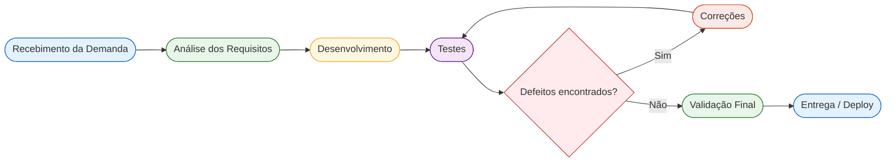

# Aula 14 — Qualidade de Processo – LocalEats

## 1. Mapeamento do Processo Atual

### Fluxo do Processo

A equipe segue um fluxo contínuo de desenvolvimento e validação das funcionalidades do LocalEats. O processo inicia com o recebimento da demanda, passa pela análise dos requisitos, implementação da solução, execução dos testes e, caso sejam encontrados defeitos, retorna para a etapa de correção. Após a validação final, a funcionalidade é disponibilizada em produção.

#### Diagrama (Mermaid)

O diagrama evidencia que a qualidade é verificada continuamente durante o processo. Sempre que um defeito é identificado nos testes, o fluxo retorna para a etapa de correções, garantindo que apenas funcionalidades validadas sejam entregues aos usuários.

---

## 2. Tabela de Entradas, Atividades e Saídas

| Etapa                 | Entrada                  | Atividade                         | Saída                   |
|:----------------------|:-------------------------|:----------------------------------|:------------------------|
| Recebimento da demanda | Solicitação do cliente   | Levantar e registrar a necessidade | Requisito documentado   |
| Análise dos requisitos | Requisito documentado    | Refinar regras de negócio         | Especificação funcional |
| Desenvolvimento        | Especificação funcional  | Implementar a funcionalidade      | Código desenvolvido     |
| Testes                 | Código desenvolvido      | Executar testes                   | Relatório de testes     |
| Correções              | Defeitos identificados   | Corrigir os problemas encontrados | Código corrigido        |
| Validação final        | Código corrigido         | Confirmar os requisitos           | Funcionalidade aprovada |
| Entrega                | Funcionalidade aprovada  | Publicar em produção              | Sistema atualizado      |

---

## 3. Reflexão sobre o Processo

### O processo utilizado pela equipe está claramente definido?

De forma geral sim, porém a documentação pode ser aprimorada para padronizar as atividades.

### Todos os integrantes seguem o mesmo fluxo de trabalho?

Esse deve ser o objetivo da equipe. A padronização reduz retrabalho e melhora a comunicação.

### Em quais etapas a qualidade é verificada?

- Análise dos requisitos
- Desenvolvimento
- Testes
- Validação final

### Quais melhorias poderiam tornar o processo mais eficiente?

- Code Review
- Integração Contínua (CI)
- Testes automatizados
- Critérios de aceitação bem definidos
- Checklists antes do deploy

### Como a qualidade do processo impacta a qualidade do produto final?

Um processo organizado reduz defeitos, melhora a comunicação entre os integrantes, aumenta a produtividade e gera um software mais confiável e de melhor qualidade.

---

## Conclusão

A qualidade do processo influencia diretamente a qualidade do software. A adoção de boas práticas, revisão contínua e testes em todas as etapas contribui para entregas mais seguras e maior satisfação dos usuários do LocalEats.
